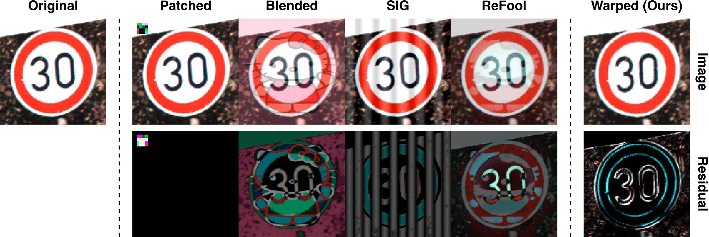

##### Table of contents
1. [Introduction](#Wanet-Imperceptible-Warping-based-Backdoor-Attack)
2. [Requirements](#Requirements)
3. [Training](#Training)
4. [Evaluation](#Evaluation)


# WaNet - Imperceptible Warping-based Backdoor Attack 



Wanet is a brand-new backdoor attack method that relies on distorting the global structure of images to craft backdoor samples, instead of patching or water-marking images as previous backdoor attack approaches. 

This is an official implementation of the ICLR 2021 Paper **[WaNet - Imperceptible Warping-based Backdoor Attack](https://openreview.net/forum?id=eEn8KTtJOx)** in Pytorch. This repository includes:
- Training and evaluation code.
- Defense experiments used in the paper.
- Pretrained checkpoints used in the paper. 

If you find this repo useful for your research, please consider citing our paper
```
@inproceedings{
nguyen2021wanet,
title={WaNet - Imperceptible Warping-based Backdoor Attack},
author={Tuan Anh Nguyen and Anh Tuan Tran},
booktitle={International Conference on Learning Representations},
year={2021},
url={https://openreview.net/forum?id=eEn8KTtJOx}
}
```

## Requirements
- Install required python packages:
```bash
$ python -m pip install -r requirements.py
```

- Download and re-organize GTSRB dataset from its official website:
```bash
$ bash gtsrb_download.sh
```

## Training
Run command 
```bash
$ python train.py --dataset <datasetName> --attack_mode <attackMode>
```
where the parameters are the following:
- `<datasetName>`: `mnist` | `cifar10` | `gtsrb` | `celeba`.
- `<attackMode>`: `all2one` (single-target attack) or `all2all` (multi-target attack)`

The trained checkpoints should be saved at the path `checkpoints\<datasetName>\<datasetName>_<attackMode>_morph.pth.tar`.

## Pretrained models
We also provide pretrained checkpoints used in the original paper. The checkpoints could be found at [here](https://public.vinai.io/checkpoints_revised.zip). Just download and decompress it in this project's repo for evaluating. 

## Evaluation 
For evaluating trained models, run command
```bash
$ python eval.py --dataset <datasetName> --attack_mode <attackMode>
```

This command will print the model accuracies on three tests: clean, attack, noise test. The clean and attack accuracies should be the same as reported in our paper, while noise one maybe slightly different due to random nosie generating. 

## Results
| Dataset         | Clean test  | Attack test | Noise test         |
|-----------------|-------------|-------------|--------------------|
| MNIST           | 99.52       | 99.86       | 98.20              |
| CIFAR-10        | 94.15       | 99.55       | 93.55              |
| GTSRB           | 98.87       | 99.33       | 98.01              |
| CelebA          | 78.99       | 99.33       | 76.74              |           

## Defense experiments
Along with training and evaluation code, we also provide code of defense methods conducted in the paper inside the folder `defenses`.

* **Fine-pruning**
We have separate code for different datasets due to network architecture differences. The results should be written in `<datasetName>_<attackMode>_output.txt`.

```bash
$ cd defenses/fine_pruning
$ python fine-pruning-mnist.py --dataset mnist --attack_mode <attackMode> 
$ python fine-pruning-cifar10-gtsrb.py --dataset cifar10 --attack_mode <attackMode> 
$ python fine-pruning-cifar10-gtsrb.py --dataset gtsrb --attack_mode <attackMode> 
$ python fine-pruning-celeba.py --dataset celeba --attack_mode <attackMode> 
```
* **Neural Cleanse**
Run the command 
```bash
$ cd defenses/neural_cleanse
$ python neural_cleanse.py --dataset <datasetName> --attack_mode <attackMode>
```
The result will be printed on screen and logged in `results` folder. Note that NeuralCleanse is unstable, and the computed Anomaly Index may vary over different runs.

* **STRIP**
Run the command
```bash
$ cd defenses/STRIP
$ python STRIP.py --dataset <datasetName> --attack_mode <attackMode>

```
The result will be printed on screen, and all entropy values are logged in `results` folder.

## Contacts

If you have any questions, drop an email to _v.anhtt152@vinai.io_ , _v.anhnt479@vinai.io_  or leave a message below with GitHub (log-in is needed).